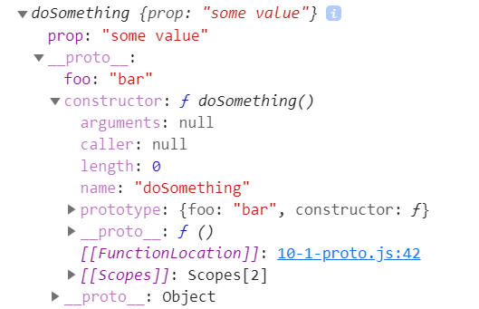
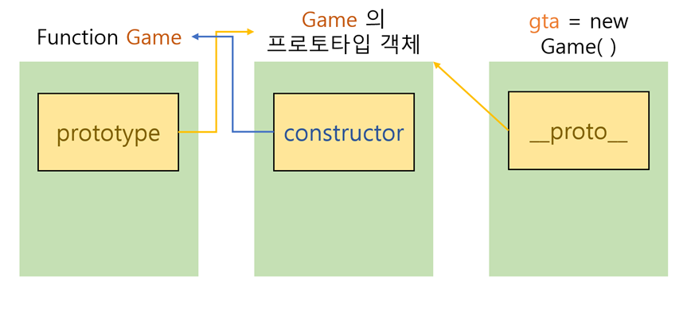

# 프로토타입

자바스크립트에서 객체는 `[[Prototype]]`이라는 속성을 가진다. 자신의 프로토타입이 되는 다른 객체를 가리키고 그 객체는 또 프로토타입을 가지고 있고 이 형식이 반복된다. null을 프로토타입으로 가지는 object에서 끝난다. 프로토타입 체인의 종점인것이다.

```js
let num = function () {
  this.a = 1;
  this.b = 2;
};

let some = new num();
// { a: 1, b: 2}

num.prototype.b = 3;
num.prototype.c = 4;
```

`num.prototype = {b:3, c:4};`라고 prototype을 지정하면 안된다. 그럴 경우 prototype chain이 망가질 우려가 있다.

위의 코드를 토대로 보면
some.[[Prototype]]은 property인 b와 c를 가진다.
some.[[Prototype]].[[Prototype]]은 Object.prototype이다.
some.[[Prototype]].[[Prototype]],[[Prototype]]은 null이다. 즉, prototype의 종단이다.

```js
function doSomething() {}
doSomething.prototype.foo = "bar";
var doSomeInstancing = new doSomething();
doSomeInstancing.prop = "some value";
console.log(doSomeInstancing);
```

위는 mdn 사이트의 예시이다.
new 연산자를 사용하면 프로토타입 기반의 `doSomething() `인스턴스를 생성할 수 있다.
new 연산자로 함수를 호출하면 해당 함수의 인스턴스 객체를 반환받는다.

위의 코드를 실행하면 콘솔창은 다음 사진과 같다.



작성한`prop`이 `"some value"`로 들어가있고 `doSomeInstancing `객체의 `__proto__`는 `doSomething.prototype`이다.

## What is **Prototype**?

```js
function Game() {}

var gta = new Game();
```



위의 코드를 기반으로 그린 그림이다.
`Game `함수의 원형인 `Game 프로토타입 객체`를 이용하여 새로운 객체` gta`를 만들어낸다.
이 `gta`라는 객체에 **proto** 속성이 자신을 만들어낸 원형인 `Game 프로토타입 객체` 를 참조하는 링크를 가리킨다. 이 숨겨진 링크를 **프로토타입**이라고 한다.

함수의 멤버인 `prototype 속성`은 `프로토타입 객체`를 참조하는 속성이다.
_new_ 연산자로 새로 만들어진 객체 안의 `__proto__ `속성은 자신을 만든 원형 프로토타입 객체를 참조하는 숨겨진 **링크**로서 프로토타입을 의미한다.

참고 사이트:

- <https://developer.mozilla.org/ko/docs/Web/JavaScript/Inheritance_and_the_prototype_chain>
- <https://www.nextree.co.kr/p7323/>
