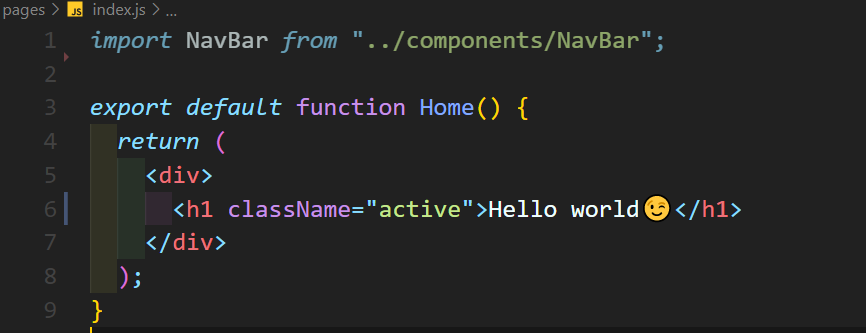
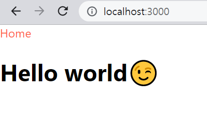

# Next.js란?

**Next.js**는 **React 프레임워크**이다.

## 특징

- Next.js는 페이지 기반의 라우팅 시스템을 가진다.
- 각 페이지마다 서버 사이드 렌더링(**SSR**)이 지원된다.
- 빠른 페이지 로딩을 위해 자동으로 code를 splitting해준다.
- **404 not found** 페이지를 제작할 수 있다. 👍🏻👍🏻
- 정적(**static**)으로 미리 렌더링(**pre-rendering**)된다.

---

- ### jsx말고 js안에서 html 작업하기

위의 사진과 같이 html형식을 js 파일 내에 적는 jsx 파일 형식을 사용하지 않고 js파일 내에서 html 작업을 해주어도 잘 동작한다.

import react를 하지 않아도 잘 동작하는 것을 볼수 있다.

---

- ### a 태그말고 **Link** 태그를 사용해야 좋다.

  Next.js에서는 a tag를 이용해 라우팅하기 보다는 Link 태그를 이용하기를 권장한다고 한다.
  a tag를 이용해 navbar를 만들어 페이지를 이동할 경우 드는 시간과 Link를 이용해 이동하는 경우 드는 시간은 차이가 난다. Link를 사용했을때는 reloading이 발생하지 않고 빠르게 페이지가 이동된다.
  이는 React.js로 라우팅을 해본 사람들이라면 이미 익숙한 사실이다.

- ### useRouter

  next.js에서 제공하는 hook 인 **useRouter**를 사용할 수 있다.

  

  아래와 같이 useRouter를 이용해 navbar를 구성할 수 있다.

