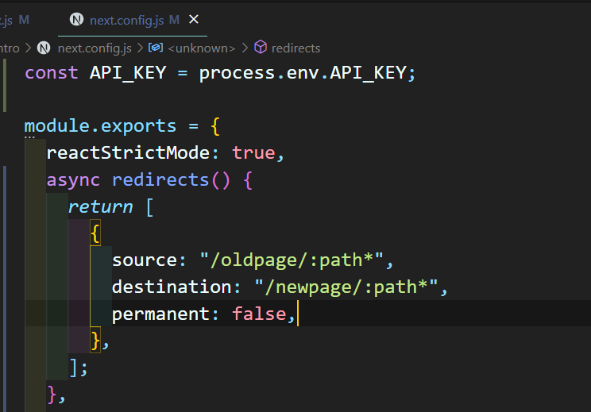

# redirect

## Next.js의 redirect?

Next.js에서는 **redirect** 기능을 사용할 수 있다. ✨

**redirect 기능** 👉🏻 특정 주소를 다른 주소로 변경시켜 redirect해주는 기능이다.

---

### 설정

_next.config.js_ 파일에 들어가서 설정할 수 있다.



redirects 메소드 안에서 배열형식으로 return하여 설정할 수 있다. 배열안에서 object를 생성하여 설정한다.

- source : redirect될 주소
- destination : redirect한 결과 주소
- permanent : true / false에 따라 다르다.
  - *true*인 경우 : 308 status code를 사용하여 redirect된 상태에서 캐시를 클라이언트 검색 엔진에 알려줄수 있다.
  - *false*인 경우 : 307 status code를 사용하여 임시적인 상태로 캐시를 사용할 수 없다.

```js
module.exports = {
  async redirects() {
    return [
      {
        source: "/old/:id*",
        destination: "/new/:id*",
        permanent: true,
      },
    ];
  },
};
```

위와 같이 source, destination주소의 끝에 '\*'를 붙이면 '/old/'뒤에 어떤 parameter가 들어가든지 '/new/'주소로 바뀔것이다. 예를 들어, '/old/1234/video/1'이란 주소로 이동하면 '/new/1234/video/1'이란 주소로 이동하게 될 것이다.

이처럼 뒤에 어떤 주소가 오든 source에 해당하는 주소를 destination 주소로 이동시킬 수도 있고, 정규표현식을 사용할 경우 해당 정규표현식에 해당하는 주소는 destination주소로 redirect 되도록 설정할 수도 있다.
