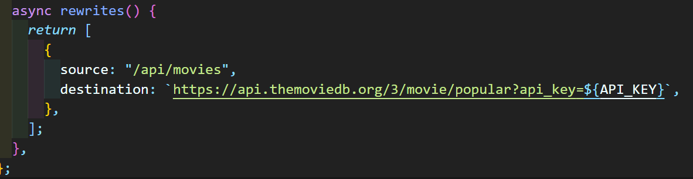

# rewrites

## Next.js의 Rewrites?

**rewrites** 기능은 요청된 path를 다른 destination path로 변경해주는 일을 한다.

next.config.js파일 내에서 설정할 수 있다.



rewrites 안에서 배열 안 object 형식으로 return해 설정한다.

```js
module.exports = {
  async rewrites() {
    return [
      {
        source: "/logout",
        destination: "/",
      },
    ];
  },
};
```

- source: 요청된 path ( 변경당할 path )
- destination: 변경 후 path
