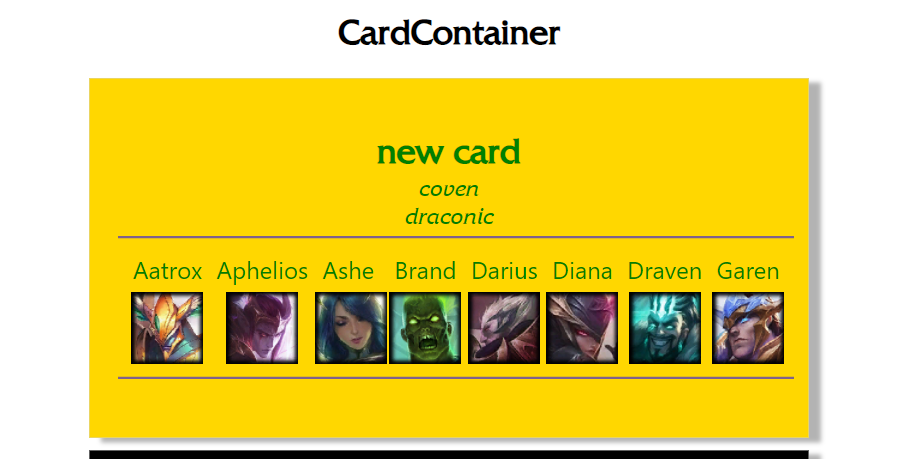

# TypeError: map of Undefined

card maker 프로젝트를 만들다가 위와 같은 에러가 발생하였다.

```js
{
  cham.map((champion) => (
    
  ));
}
```

위처럼 cham 이라는 array 변수 안의 champion들에 대해 각각 이미지를 불러오는 코드를 작성했다.

인터넷 search 를 해본 결과! 😹

_비동기적으로 데이터가 처리될 때 component는 적어도 한번 데이터가 불려지기 이전에 rendering이 발생한다_

위의 이유에 의해 **TypeError: map of Undefined** 에러가 발생하는 것이다.

따라서

```js
{
  cham &&
    cham.map((champion) => (
      
    ));
}
```

cham&& 을 추가하여 cham 값이 존재할 경우 즉 true 일 경우만 코드가 작동하도록 코딩해준다. 그리하여 결과적으로 코드가 아주 잘 동작되었다.

**결과 사진**


