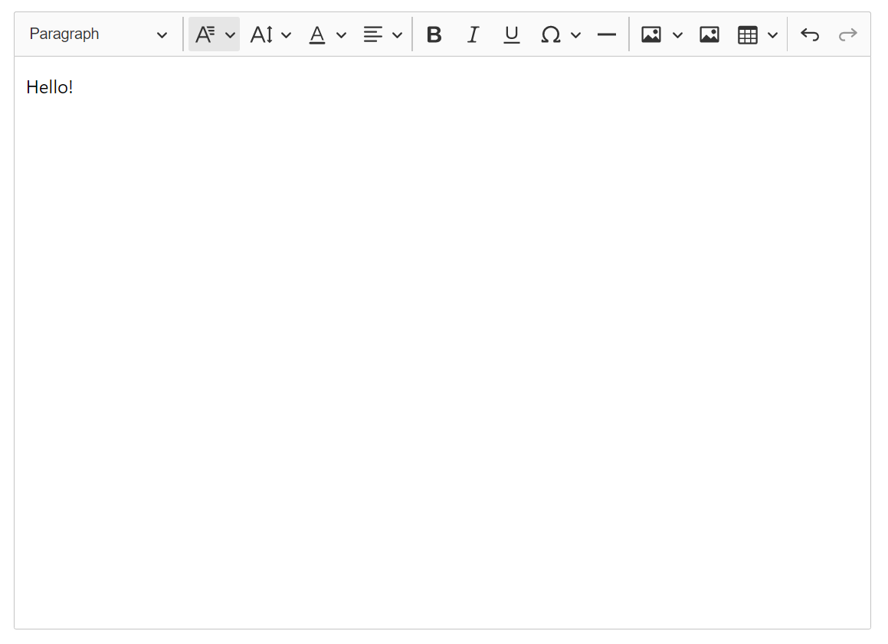

# ckEditor5 와 cloudinary로 이미지 업로드 관리하기 😀

## 서론

ckEditor5를 이용하여 게시판 글 작성 기능을 구현하고 있었다. 사용자가 글 작성시 사진을 삽입할 경우 업로드 한 사진을 저장하고 사용자의 ckeditor 화면에 해당 사진을 보여주는 기능을 구현해야 했다. 그리하여 ckediotor의 image upload 기능과 cloudinary의 사진 저장 기능을 함께 사용하기로 했다.

---

### cloudinary 를 고른 이유?

ckEditor5에서 제공하는 image upload adapter도 있고 다른 여러 image upload adapter가 존재한다. 그들 중 cloudinary를 고른 이유는 clodinary는 사용자가 큰 용량의 사진을 업로드할 경우 해당 사진을 내가 지정해둔 크기로 바꾸어 저장해주기 때문에 용량, 성능 면에서 좋을거라 판단했다. 따라서 cloudinary와 ckEditor 이 둘을 사용해 image upload 기능을 구현해보자.

---

## 방법



위는 내가 프로젝트 상에서 만들어놓은 custom ckeditor이다.

여기에 이제 이미지 업로드 기능을 추가해보자.

😉

**cloudinary documents**에 들어가보면 설명이 잘 되어 있다. <https://cloudinary.com/documentation/upload_images>


우리가 직접 cloudinary 의 upload 기능을 사용하기 위해서 cloudinary 가 제공하는 REST API를 사용해야 한다. cloudinary documents를 보면 HTTPS POST request를 특정 url 에 send해야 한다고 작성되어 있다. url 의 형식은

```
https://api.cloudinary.com/v1_1/<cloud name>/<resource_type>/upload
```

이와 같다. cloud name 과 resource_type은 개인 cloudinary settings에서 확인할 수 있다.


cloudinary documents에 있는 Example Code를 토대로 우선

**image_uploader.js**

```js
class ImageUploader {
  async upload(file) {
    const data = new FormData();
    data.append("file", file);
    data.append("upload_preset", "자신의 preset코드를 여기에 작성");
    const res = await fetch(
      "https://api.cloudinary.com/v1_1/cloudname/image/upload",
      {
        method: "POST",
        body: data,
      }
    );
    return await res.json();
  }
}

export default ImageUploader;
```

ImageUploader class를 구현한다. 이는 업로드된 사진 파일을 cloudinary에 저장한다.

**img_upload_adapter.jsx**

```js
function MyCustomUploadAdapterPlugin(editor) {
  editor.plugins.get("FileRepository").createUploadAdapter = (loader) => {
    return new MyUploadAdapter(loader);
  };
}

class MyUploadAdapter {
  constructor(loader) {
    this.loader = loader;
  }

  upload() {
    return this.loader.file.then(
      (file) =>
        new Promise((resolve, reject) => {
          this._initRequest();
          this._initListeners(resolve, reject, file);
          this._sendRequest(file);
        })
    );
  }

  abort() {
    if (this.xhr) {
      this.xhr.abort();
    }
  }

  _initRequest() {
    const xhr = (this.xhr = new XMLHttpRequest());
    xhr.open(
      "POST",
      "https://api.cloudinary.com/v1_1/cloudname/image/upload",
      true
    );
    xhr.responseType = "json";
  }

  _initListeners(resolve, reject, file) {
    const xhr = this.xhr;
    const genericErrorText = `Couldn't upload file: ${file.name}.`;
    xhr.addEventListener("error", () => reject(genericErrorText));
    xhr.addEventListener("abort", () => reject());
    xhr.addEventListener("load", () => {
      const response = xhr.response;
      if (!response || response.error) {
        return reject(
          response && response.error ? response.error.message : genericErrorText
        );
      }
      resolve({
        default: response.url,
      });
    });
  }

  _sendRequest(file) {
    const data = new FormData();
    data.append("upload_preset", "presetcode");
    data.append("file", file);
    this.xhr.send(data);
  }
}

export default MyCustomUploadAdapterPlugin;
```

이 부분이 제일 핵심인 것이다. 위의 함수 **MyCustomUploadAdapterPlugin** 는 cloudinary를 custom upload adapter 로 만들고 등록한다. 이러한 plugin을 만들어 ckeditor component가 호출되는 부분에서 plugin으로 넘겨준다.

```js
import MyCustomUploadAdapterPlugin from "../custom_img_upload/custom_img_upload";

<CKEditor editor={ClassicEditor} config={{
    plugins: [...installedPlugins, MyCustomUploadAdapterPlugin]
    toolbar: [...생략]/>
```

위와 같이 plugin에 image upload adapter plugin을 작성해주고

**index.js**

```js
import ImageUploader from "./service/image_uploader";
import MyCustomUploadAdapterPlugin from "./components/custom_img_upload/custom_img_upload";

const imageUploader = new ImageUploader();
const FileInput = (props) => new MyCustomUploadAdapterPlugin(imageUploader);

ReactDOM.render(
  <React.StrictMode>
    <App FileInput={FileInput} />
  </React.StrictMode>,
  document.getElementById("root")
);
```

index.js에서 위와 같이 image uploader와 file input에 대한 변수를 선언한다. 그 후 `<App>`에 prop으로 file input을 전달하고 그 후 ckeditor를 사용하는 파일까지 전달을 하면 구현 끝이다.
