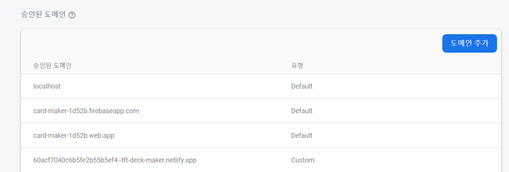
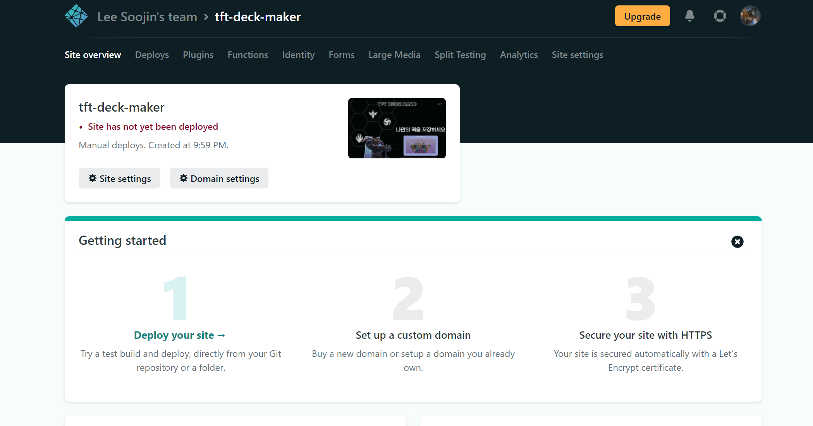
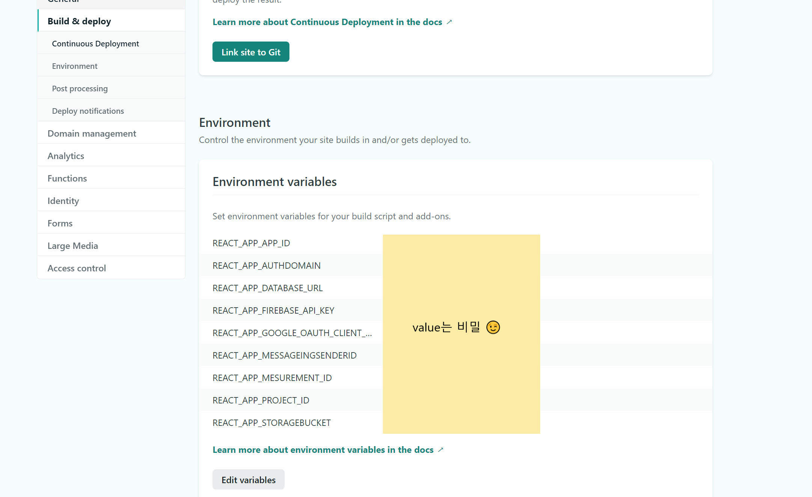

# Netlify 로 사이트 배포하기 (feat. React app)

Netlify를 이용해 tft_deck_maker 라는 프로젝트를 사이트로 배포해보았다. 그 과정에서 알게된 것들을 여기에 적어보려 한다.

---

## _warning: LF will be replaced by CRLF in in some/file.file. The file will have its original line endings in your working directory._

위와 같은 warning이 발생했었다. 찾아보니 일종의 Whitespace error라고 한다. 유닉스에서는 LF를 사용하고 윈도우에서는 CR,LF를 사용하기 때문에 Git이 어느쪽을 사용해야 할지 혼란이 와서 생기는 warning이라고 한다.

```
git config --global core.autocrlf true
```

저 warning은 위와 같은 코드로 해결할 수 있다. 지금 해당 프로젝트에만 적용시키고 싶다면 --global을 빼면된다. core.autocrlf가 자동으로 LF, CRLF로 변환시켜주는 역할을 하는 것이다.

참고한 글: <https://blog.jaeyoon.io/2018/01/git-crlf.html>

---

## Firebase를 이용해 만든 react app에서 로그인 기능이 작동되지 않는다?

netlify로 성공적으로 deploy까지 한 후에 url이 생성되어졌다. 그리고 들뜬 마음으로 해당 url에 접속했을 때 로그인 기능이 작동하지 않는 터무니없는 일이 발생했다 😫 뭐가 문제인지 찾아보니 엉뚱한 부분을 놓쳤다.

Firebase Authentication에서 배포된 사이트의 url을 도메인추가 해주지 않아서 발생한 것이다.

사이트 구동 후 검사 console창에서 내가 본 오류 메세지는 아래와 같았다.

```
Go {code: "auth/unauthorized-domain", message: "This domain...
```



도메인 추가를 하고 나니 Google 로그인, 회원가입 기능 등이 잘 동작 되었다.

---

## Netlify 배포 시 environment variables는 어떻게 하지?

배포 과정 중 제일 궁금했던 부분이었다. 내가 .env 파일에 넣어둔 REACT_APP_API_KEY 같은 숨겨놓은 변수들은 어떻게 전달해줘야할지 난감했다. Netlify site setting에서 처리할 수 있다는걸 몇 번 서치해보고 나서 알게 되었다.



내가 netlify에서 만들어놓은 해당 사이트 설정으로 들어간다. 그 후 Build & Deploy 카테고리에서 Environment 메뉴로 들어간다.



그리고 위와 같이 key와 value를 입력한 뒤 Save 하면 끝이다!
environment variables 처리하기가 생각보다 간단했다.

---

## npm ERR! & npm WARN

배포 과정 중 나를 제일 힘들게 한건 바로 npm WARN이다. 한두개가 아닌 아주 여러개의 WARNING들이 나를 힘들게 했다.

⇓ 내가 마주친 오류들 ⇓

### 1.

```
npm WARN read-shrinkwrap This version of npm is compatible with lockfileVersion@1, but package-lock.json was generated for lockfileVersion@2. I'll try to do my best with it!
```

### 2.

```
npm ERR! notsup Unsupported platform for fsevents@2.3.2: wanted {"os":"darwin","arch":"any"} (current: {"os":"win32","arch":"x64"})
```

### 3.

```
npm ERR! code EEXIST
```

### 4. 이건 npm 오류는 아니고 그냥 Error!

```
Error: Cannot find module 'update-notifier'
```

죄다 처음보는 오류들이라 서치를 엄청했다. 그리고 내가 해낸 방법은 다음과 같았다.

**① node_modules, package-lock.json 삭제**
**② npm cache verify 로 npm cache 청소**
**③ npm install 을 해서 node_modules 다시 설치**

위와 같은 과정을 거치고 난 후 다시 yarn build를 하고 netlify 배포 과정을 진행하니까 정상적으로 사이트 netlify deploy까지 되었다.
내가 마주한 모든 npm ERR과 npm warn들이 위의 과정에 의해서 해결된 것인진 정확히는 모르지만 성공적인 방법이었기에 기록한다.

1번의 warn은 확실히 npm install을 다시하고 나서야 lockfileVersion이 2에서 1로 바뀐 것을 볼 수 있었다.

---

배포 과정에 필요한 코드만 보면 간단해 보이지만 실제로 해보니 맞닥뜨리게 되는 error 나 warning들이 많아서 시간이 꽤 걸렸다. 계속 이렇게 새로운 error를 해결해 나가는게 나에게 큰 도움이 될 것이라 생각한다.
